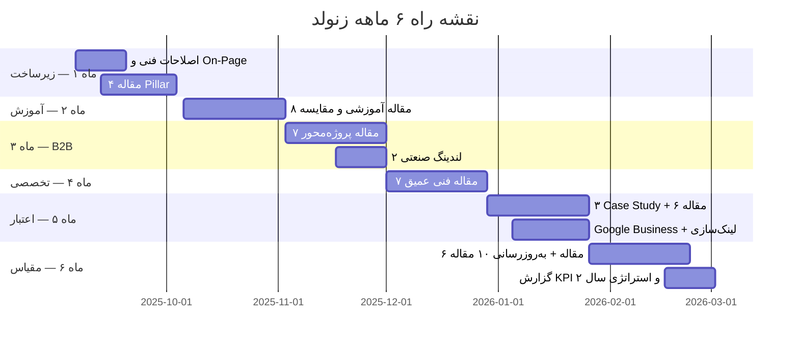
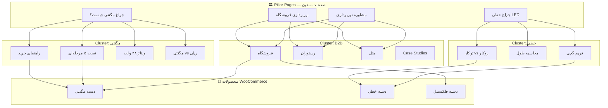
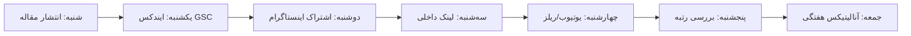

# برنامه ۶ ماهه سئو و محتوا — زنولد (xenoled.lighting)

> **هدف:** رسیدن به ۱۵۰+ صفحه ایندکس، ۳۰+ مقاله، ۵ کلیدواژه در Top 10 و ۳۰۰۰ بازدید ارگانیک ماهانه  
> **شروع:** شهریور ۱۴۰۵ | **پایان:** اسفند ۱۴۰۵  
> **نرخ انتشار:** ۲ محتوا در هفته (۱ مقاله + ۱ فعالیت فنی/لندینگ)

---

## نمای کلی ۶ ماه



---

## معماری محتوا (Content Hub)



---

## تقویم ۲۴ هفته (خلاصه)

| هفته | تاریخ | نوع | عنوان | فایل |
|------|-------|-----|-------|------|
| ۱ | ۶–۱۲ شهریور | 🔧 فنی | اصلاح About Us + Meta صفحه اصلی | `page-copy/` |
| ۱ | ۶–۱۲ شهریور | 🔧 فنی | توضیحات ۹ دسته محصول | `page-copy/category-descriptions.md` |
| ۲ | ۱۳–۱۹ شهریور | 📝 مقاله | چراغ خطی LED چیست؟ | `articles/01-cheragh-khati-led.md` |
| ۲ | ۱۳–۱۹ شهریور | 📝 مقاله | تفاوت چراغ مگنتی و ریلی | `articles/02-magnetic-vs-track.md` |
| ۳ | ۲۰–۲۶ شهریور | 📝 مقاله | راهنمای انتخاب چراغ سقفی | `articles/03-downlight-guide.md` |
| ۳ | ۲۰–۲۶ شهریور | 📝 مقاله | نورپردازی فروشگاه با مگنتی | `articles/04-store-lighting.md` |
| ۴ | ۲۷ شهریور–۳ مهر | 📝 مقاله | چراغ فلکسیبل LED | `articles/05-flexible-light.md` |
| ۴ | ۲۷ شهریور–۳ مهر | 📝 مقاله | فریم گچی نامرئی | `articles/06-invisible-frame.md` |
| ۵ | ۴–۱۰ مهر | 📝 مقاله | نصب چراغ مگنتی ۵ مرحله | `articles/07-magnetic-installation.md` |
| ۵ | ۴–۱۰ مهر | 📝 مقاله | ولتاژ ۴۸ ولت در مگنتی | `articles/08-48v-magnetic.md` |
| ۶ | ۱۱–۱۷ مهر | 📝 مقاله | دمای رنگ نور — راهنمای انتخاب | `articles/09-color-temperature.md` |
| ۶ | ۱۱–۱۷ مهر | 📝 مقاله | CRI و Ra در چراغ LED | `articles/10-cri-guide.md` |
| ۷ | ۱۸–۲۴ مهر | 📝 مقاله | چراغ کمربندی Belt Light | `articles/11-belt-light.md` |
| ۷ | ۱۸–۲۴ مهر | 📝 مقاله | چراغ اسلیم اولترا | `articles/12-ultra-slim.md` |
| ۸ | ۲۵ مهر–۱ آبان | 📝 مقاله | ۱۰ اشتباه نورپردازی آشپزخانه | `articles/13-kitchen-mistakes.md` |
| ۸ | ۲۵ مهر–۱ آبان | 📝 مقاله | نورپردازی گالری و موزه | `articles/14-gallery-lighting.md` |
| ۹ | ۲–۸ آبان | 📝 مقاله | نورپردازی رستوران و کافه | `articles/15-restaurant-lighting.md` |
| ۹ | ۲–۸ آبان | 🏠 لندینگ | صفحه نورپردازی رستوران | `landing-pages/restaurant.md` |
| ۱۰ | ۹–۱۵ آبان | 📝 مقاله | نورپردازی هتل و لابی | `articles/16-hotel-lighting.md` |
| ۱۰ | ۹–۱۵ آبان | 📝 مقاله | محاسبات روشنایی Lux | `articles/17-lux-calculation.md` |
| ۱۱ | ۱۶–۲۲ آبان | 📊 Case Study | پروژه فروشگاه پوشاک | `articles/18-case-study-retail.md` |
| ۱۱ | ۱۶–۲۲ آبان | 🏠 لندینگ | صفحه نورپردازی فروشگاه | `landing-pages/retail-store.md` |
| ۱۲ | ۲۳–۲۹ آبان | 📝 مقاله | مقایسه برندهای مگنتی ایران | `articles/19-brand-comparison.md` |
| ۱۲ | ۲۳–۲۹ آبان | 📝 مقاله | گارانتی و خدمات پس از فروش LED | `articles/20-warranty-guide.md` |
| ۱۳ | ۳۰ آبان–۶ آذر | 📝 مقاله | استاندارد روشنایی ISIRI | `articles/21-isiri-standard.md` |
| ۱۳ | ۳۰ آبان–۶ آذر | 📝 مقاله | IP Rating در چراغ LED | `articles/22-ip-rating.md` |
| ۱۴ | ۷–۱۳ آذر | 📝 مقاله | Dimming و DALI در مگنتی | `articles/23-dimming-dali.md` |
| ۱۴ | ۷–۱۳ آذر | 📝 مقاله | نورپردازی نمای ساختمان | `articles/24-facade-lighting.md` |
| ۱۵ | ۱۴–۲۰ آذر | 📝 مقاله | چراغ ضد رطوبت IP44/IP65 | `articles/25-moisture-proof.md` |
| ۱۵ | ۱۴–۲۰ آذر | 📝 مقاله | برق‌کشی و ترانس مگنتی | `articles/26-magnetic-wiring.md` |
| ۱۶ | ۲۱–۲۷ آذر | 📝 مقاله | نورپردازی هوشمند و IoT | `articles/27-smart-lighting.md` |
| ۱۶ | ۲۱–۲۷ آذر | 📊 Case Study | پروژه دفتر کار | `articles/28-case-study-office.md` |
| ۱۷ | ۲۸ آذر–۴ دی | 📝 مقاله | نورپردازی تهران — راهنمای محلی | `articles/29-tehran-local.md` |
| ۱۷ | ۲۸ آذر–۴ دی | 🏠 لندینگ | صفحه مشاوره رایگان | `landing-pages/free-consultation.md` |
| ۱۸ | ۵–۱۱ دی | 📝 مقاله | چراغ ریلی — راهنمای کامل | `articles/30-track-light-guide.md` |
| ۱۸ | ۵–۱۱ دی | 📝 مقاله | چراغ دکوراتیو LED | `articles/31-decorative-light.md` |
| ۱۹ | ۱۲–۱۸ دی | 📝 مقاله | نورپردازی اتاق خواب | `articles/32-bedroom-lighting.md` |
| ۱۹ | ۱۲–۱۸ دی | 📊 Case Study | پروژه ویلا مسکونی | `articles/33-case-study-villa.md` |
| ۲۰ | ۱۹–۲۵ دی | 📝 مقاله | UGR و خیرگی — راهنمای معماران | `articles/34-ugr-glare.md` |
| ۲۰ | ۱۹–۲۵ دی | 🔧 فنی | به‌روزرسانی ۵ مقاله قدیمی | — |
| ۲۱ | ۲۶ دی–۱ بهمن | 📝 مقاله | چراغ خطی توکار vs روکار | `articles/35-linear-recessed-vs-surface.md` |
| ۲۱ | ۲۶ دی–۱ بهمن | 🏠 لندینگ | صفحه محاسبات روشنایی | `landing-pages/lux-calculator.md` |
| ۲۲ | ۲–۸ بهمن | 📝 مقاله | نورپردازی کلینیک و مطب | `articles/36-clinic-lighting.md` |
| ۲۲ | ۲–۸ بهمن | 🔧 فنی | لینک‌سازی داخلی همه مقالات | — |
| ۲۳ | ۹–۱۵ بهمن | 📝 مقاله | انتخاب چراغ برای سقف کاذب | `articles/37-false-ceiling.md` |
| ۲۳ | ۹–۱۵ بهمن | 🔧 فنی | به‌روزرسانی ۵ مقاله | — |
| ۲۴ | ۱۶–۲۲ بهمن | 📊 گزارش | گزارش KPI ۶ ماهه + استراتژی سال ۲ | `KPI-REPORT-TEMPLATE.md` |
| ۲۴ | ۱۶–۲۲ بهمن | 🔧 فنی | Audit نهایی Screaming Frog | — |

---

## جریان هفتگی (Weekly Workflow)



---

## KPI ماهانه

| ماه | مقالات جدید | ایندکس (تجمعی) | ترافیک ارگانیک | Top 10 |
|-----|-------------|----------------|----------------|--------|
| ۱ | ۴ + فیکس فنی | ۲۰ | ۵۰ | ۰ |
| ۲ | ۸ | ۴۵ | ۲۰۰ | ۱ |
| ۳ | ۷ + ۲ لندینگ | ۷۵ | ۵۰۰ | ۳ |
| ۴ | ۷ | ۱۰۰ | ۱۰۰۰ | ۵ |
| ۵ | ۹ + ۳ Case Study | ۱۳۰ | ۲۰۰۰ | ۱۰ |
| ۶ | ۶ + آپدیت ۱۰ | ۱۵۰+ | ۳۰۰۰+ | ۱۵+ |

---

## ساختار فولدر

```
xenoled/
├── 6-MONTH-MASTER-PLAN.md          ← این فایل
├── SEO-AUDIT-AND-STRATEGY.md       ← ممیزی اولیه
├── KPI-REPORT-TEMPLATE.md          ← قالب گزارش پایان ۶ ماه
├── content-calendar/
│   ├── month-01.md … month-06.md   ← جزئیات هفتگی
├── articles/
│   ├── 01-cheragh-khati-led.md …  ← ۳۷ مقاله کامل
├── landing-pages/
│   ├── retail-store.md …          ← ۴ لندینگ
└── page-copy/
    ├── about-us.md
    ├── homepage-meta.md
    └── category-descriptions.md
```

---

## چک‌لیست انتشار هر مقاله در WordPress

- [ ] کپی از فایل `.md` مربوطه
- [ ] تنظیم Title و Meta Description (در فایل آماده است)
- [ ] انتخاب دسته «مقالات تخصصی»
- [ ] تصویر شاخص ۱۲۰۰×۶۳۰ با alt فارسی
- [ ] ۳ لینک داخلی به محصول/دسته
- [ ] FAQ Schema (بخش سوالات انتهای مقاله)
- [ ] CTA «مشاوره رایگان» در انتها
- [ ] اشتراک در اینستاگرام `@xenoled.lighting`
- [ ] بررسی ایندکس در GSC بعد از ۴۸ ساعت

---

## لینک‌های محصول برای Internal Linking

| دسته | URL |
|------|-----|
| چراغ مگنتی | `https://xenoled.lighting/product-category/magnetic-light/` |
| چراغ خطی | `https://xenoled.lighting/product-category/linear-light/` |
| چراغ ریلی | `https://xenoled.lighting/product-category/track-light/` |
| چراغ سقفی | `https://xenoled.lighting/product-category/down-light/` |
| چراغ فلکسیبل | `https://xenoled.lighting/product-category/flexible-light/` |
| فریم گچی | `https://xenoled.lighting/product-category/invisible-frame/` |
| چراغ کمربندی | `https://xenoled.lighting/product-category/belt-light/` |
| چراغ اسلیم | `https://xenoled.lighting/product-category/ultra-thin-light/` |
| چراغ دکوراتیو | `https://xenoled.lighting/product-category/decorative-light/` |

---

*تهیه‌شده برای تیم زنولد — شهریور ۱۴۰۵*
