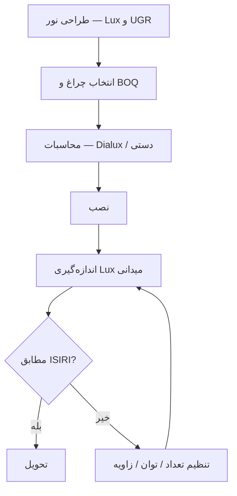

# استاندارد روشنایی ایران (ISIRI) — خلاصه کاربردی

در پروژه‌های ساختمانی ایران، **استاندارد ملی روشنایی** — منتشرشده توسط **مؤسسه استاندارد و تحقیقات صنعتی ایران (ISIRI)** — مرجع فنی برای **طراحی، تأیید نظام مهندسی و تحویل پروژه** است. رعایت ISIRI فقط «اجبار قانونی» نیست؛ **کیفیت بینایی، ایمنی، بهره‌وری** و **رضایت کاربر نهایی** را تضمین می‌کند.

این مقاله **خلاصه کاربردی** است — نه متن کامل استاندارد — تا معمار، طراح نور، پیمانکار و کارفرما بتوانند **سریع** بدانند در هر فضا **چه سطح روشنایی (Lux)**، **چه UGR** و **چه CRI** لازم است و **زنولد** چگونه در **محاسبات و تأمین تجهیزات** کمک می‌کند.

## ISIRI در روشنایی چیست؟

**ISIRI** مجموعه استانداردهای ملی ایران است که بر پایه **IEC**، **CIE** و **EN** تدوین شده و برای **سازگاری با اقلیم، برق شهری و فرهنگ استفاده** بومی‌سازی شده. در حوزه روشنایی، مهم‌ترین مراجع:

| استاندارد / موضوع | کاربرد |
|-------------------|--------|
| **سطح روشنایی (Illuminance)** | Lux مورد نیاز هر فضا |
| **ت_uniformity (یکنواختی)** | نسبت حداقل به میانگین |
| **UGR (خیرگی)** | فضاهای اداری و آموزشی |
| **CRI / Ra** | نمایش رنگ |
| **دمای رنگ Correlated Color Temperature** | حس بصری فضا |

> **توجه:** شماره دقیق هر استاندارد ISIRI ممکن است با **بازنگری** تغییر کند. قبل از ارائه به ناظر، **نسخه به‌روز** را از portal.isiri.gov.ir بررسی کنید.

## Lux — سطح روشنایی مورد نیاز فضاها

**Lux (لوکس)** = لومن بر متر مربع. جدول زیر **مقادیر رایج** در پروژه‌های ایران است:

| فضا | Lux توصیه‌شده (ISIRI / CIE) | UGR max | CRI min |
|-----|----------------------------|---------|---------|
| راهرو و پارکینگ | ۱۰۰–۱۵۰ | — | ۴۰ |
| پله و خروج اضطراری | ۱۵۰–۲۰۰ | — | ۴۰ |
| اتاق خواب مسکونی | ۱۰۰–۱۵۰ | — | ۸۰ |
| نشیمن و پذیرایی | ۱۵۰–۳۰۰ | — | ۸۰ |
| آشپزخانه خانگی | ۳۰۰–۵۰۰ | — | ۸۰ |
| دفتر کار (کامپیوتر) | ۵۰۰ | **≤ ۱۹** | ۸۰ |
| کلاس درس | ۳۰۰–۵۰۰ | **≤ ۱۹** | ۸۰ |
| فروشگاه عمومی | ۵۰۰–۷۵۰ | ۲۲ | **۹۰** |
| بوتیک و جواهرفروشی | ۷۵۰–۱۰۰۰ | ۱۹ | **۹۰+** |
| آزمایشگاه | ۵۰۰–۷۵۰ | ۱۹ | **۹۰** |
| بیمارستان — راهرو | ۲۰۰ | — | ۸۰ |
| اتاق معاینه | ۵۰۰–۱۰۰۰ | ۱۹ | **۹۰** |

### یکنواختی روشنایی

ISIRI معمولاً **نسبت یکنواختی** را نیز بررسی می‌کند:

- **Emin / Eavg ≥ 0.6** در بسیاری از فضاهای عمومی
- در اداری **0.7** توصیه می‌شود

یعنی تیره‌ترین نقطه اتاق نباید کمتر از ۶۰–۷۰٪ میانگین روشنایی باشد. **چراغ خطی** و **مگنتی** با **فاصله‌گذاری صحیح** (که تیم **زنولد** در محاسبات رایگان انجام می‌دهد) به یکنواختی کمک می‌کند.

## UGR — Unified Glare Rating

**UGR** شاخص **خیرگی** است — نور زیاد مستقیم در چشم کاربر. در **دفاتر اداری** ISIRI و ISO 8995 معمولاً **UGR ≤ ۱۹** را برای کار با مonitor توصیه می‌کنند.

### راهکارهای کاهش UGR

1. **چراغ با optic مناسب** (Deep Recessed، Louver)
2. **موقعیت نور** خارج از زاویه دید ۴۵°
3. **سطح‌های مات** روی میز و پارتیشن
4. **Dimming** برای ساعات مختلف

**چراغ خطی زنولد** با **optic ضد خیرگی** برای پروژه‌های اداری طراحی شده است.

## CRI — شاخص نمایش رنگ

**CRI (Ra)** از ۰ تا ۱۰۰: هرچه بالاتر، رنگ طبیعی‌تر.

| Ra | کاربرد |
|----|--------|
| < 80 | پارکینگ، انبار |
| 80–85 | اداری، مسکونی عمومی |
| **90+** | فروشگاه، رستوران، گالری، کلینیک |

ISIRI برای **فضاهای تجاری و بهداشتی** CRI بالا را توصیه می‌کند. **زنولد** در سری پروژه‌ای **Ra 90+** با **SDCM ≤ 3** (یکنواختی دما) ارائه می‌دهد.

## دمای رنگ (Kelvin) — ISIRI و کاربرد

| دما | حس | فضا |
|-----|-----|-----|
| 2700–3000K | گرم | هتل، رستوران، مسکونی |
| 4000K | خنثی | اداری، فروشگاه |
| 5000–6500K | سرد | بیمارستان، آزمایشگاه |

**ISIRI** معمولاً **یکسان بودن دمای رنگ** در یک فضا را توصیه می‌کند. ترکیب 3000K و 5000K در یک سالن **بدون طراحی آگاهانه** ممنوعِ حرفه‌ای است.

## فرآیند تأیید پروژه با ISIRI



### ابزار اندازه‌گیری

- **Lux meter** کالیبره (کلاس ۲ یا بهتر)
- اندازه‌گیری در **ارتفاع کار** (۰.75m اداری، ۰.85m فروشگاه)
- **Grid 9 یا 12 نقطه** در اتاق

**زنولد** در پروژه‌های B2B، **گزارش Lux پیش از و پس از نصب** ارائه می‌دهد.

## ISIRI و چراغ LED — مزایا

LED نسبت به فلورسنت قدیمی:

| موضوع | فلورسنت | LED |
|-------|---------|-----|
| CRI | ۶۰–۷۰ | **۸۰–۹۵** |
| UGR | بالا (با لامپ باز) | **کنترل optic** |
| یکنواختی | افت سریع | **پایدار** |
| Dimming | محدود | **Triac / 0-10V / DALI** |
| بازده انرژی | ۵۰–۸۰ lm/W | **۱۰۰–۱۵۰+ lm/W** |

## الزامات خاص — آشپزخانه، سرویس، پارکینگ

### آشپزخانه تجاری

- Lux: **۵۰۰–۷۵۰**
- IP: **حداقل IP44** (ترجیحاً IP65 نزدیک heat)
- CRI: **۹۰+** (نمایش مواد غذایی)

### سرویس بهداشتی

- Lux: **۲۰۰–۳۰۰**
- IP: **IP44** (ناحیه مرطوب)

### پارکینگ

- Lux: **۷۵–۱۵۰**
- **سنسور حضور** برای صرفه‌جویی انرژی (ISIRI energy guideline)

## ISIRI و صرفه‌جویی انرژی

استانداردهای ISIRI در حوزه **مصرف انرژی ساختمان** (موازى **موضوع ۱۹** نظام مهندسی) با **Lm/W بالا**، **Dimming** و **کنترل هوشمند** هم‌راستا هستند. **چراغ LED زنولد** با بازده **۱۲۰+ lm/W** به کاهش بار الکتریکی کمک می‌کند.

## چک‌لیست ISIRI برای معمار

- [ ] Lux هر فضا در **جدول نقشه** درج شده؟
- [ ] UGR برای اداری **≤ ۱۹** محاسبه شده؟
- [ ] CRI فروشگاه/رستوران **≥ ۹۰**؟
- [ ] IP سرویس و آشپزخانه **تأیید** شده؟
- [ ] **یکنواختی** Emin/Eavg بررسی شده؟
- [ ] **Emergency lighting** جداگانه (ISIRI/IEC 60598-2-22)؟
- [ ] BOQ با **مدل دقیق** و **توان** مشخص؟

## نقش زنولد در انطباق با ISIRI

| خدمت | توضیح |
|------|-------|
| **محاسبات Lux رایگان** | Dialux / دستی |
| **پیشنهاد BOQ** | خطی، مگنتی، سقفی |
| **دیتاشیت فارسی** | CRI، lm/W، UGR |
| **بازدید میدانی** | تهران و پروژه‌های بزرگ |
| **گزارش اندازه‌گیری** | پس از نصب |

تماس: **۰۲۱-۸۸۷۱۶۳۷۵** | [xenoled.lighting](https://xenoled.lighting)

## استانداردهای مرتبط ISIRI — فهرست کاربردی

علاوه بر سطح Lux، این **مراجع** در پروژه‌های روشنایی ایران مطرح می‌شوند:

| موضوع | استاندارد / مرجع | کاربرد |
|-------|------------------|--------|
| نصب الکتریکی | IEC 60364 / ISIRI | ساختمان |
| چراغ و ایمنی | IEC 60598 | fixture |
| روشنایی اضطراری | IEC 60598-2-22 | خروج |
| IP | IEC 60529 | رطوبت |
| UGR | CIE 117 / EN 12464 | اداری |
| بازده انرژی | موضوع ۱۹ | بهینه‌سازی |

## روشنایی اضطراری — جدا از ISIRI معمول

**ISIRI** برای **روشنایی اضطراری** (Emergency) الزامات **جداگانه** دارد:

- **Lux راهرو خروج:** حداقل **۱ lux** در مرکز خط
- **مدت باتری:** معمولاً **۱–۳ ساعت**
- **علامت‌گذاری** خروج

**چراغ LED معمولی** جایگزین Emergency **نیست**. در BOQ جداگانه درج کنید.

## مثال محاسبه — کلاس درس ۶۰m²

| پارامتر | مقدار |
|---------|-------|
| Lux هدف | ۵۰۰ |
| UF | 0.6 |
| MF | 0.8 |
| چراغ خطی | ۴۰۰۰ lm |

```
N = (500 × 60) / (4000 × 0.6 × 0.8) ≈ 16 fixture
```

**زنولد** این محاسبه را **رایگان** برای پروژه‌های آموزشی انجام می‌دهد.

## UGR — راهنمای خلاصه معمار

**UGR** به **زاویه دید، luminance و پس‌زمینه** بستگی دارد:

- **Deep recessed** optic → UGR پایین‌تر
- **میز براق** → UGR بالاتر
- **فاصله چراغ از خط دید** → UGR کمتر

**Dialux** UGR را grid-based محاسبه می‌کند. **زنولد** فایل Dialux برای **B2B** تهیه می‌کند.

## LPD — توان مجاز روشنایی

**Lighting Power Density** = وات بر متر مربع:

| فضا | LPD max تقریبی |
|-----|----------------|
| اداری | ۱۰–۱۳ W/m² |
| فروشگاه | ۱۵–۱۸ W/m² |
| پارکینگ | ۵–۸ W/m² |

**LED 120+ lm/W** LPD را **بدون افت Lux** پایین می‌آورد.

## چک‌لیست تحویل ISIRI

- [ ] **گزارش Lux** میدانی
- [ ] **BOQ** با مدل دقیق
- [ ] **دیتاشیت** CRI
- [ ] **Emergency** جداگانه

## فضاهای خاص — ISIRI دقیق‌تر

### بیمارستان

| فضا | Lux | CRI | UGR |
|-----|-----|-----|-----|
| راهرو | 200 | 80 | — |
| اتاق بیمار | 100–300 | 90 | 19 |
| اتاق عمل | 1000 | 90 | 19 |

**چراغ خطی زنولد** با **optic ضد خیرگی** برای **اتاق‌های درمان**.

### آزمایشگاه و clean room

**Lux 750+**، **CRI 90+**، **بدون درز IP** مناسب. **لرزش و EMI** fixture بر **تجهیزات حساس** — **دیتاشیت** الزام.

### پارکینگ و تأسیسات

**Lux 75–150**، **سنسور حضور**، **Emergency جدا**. **IP54** برای **رطوبت**.

## رابطه ISIRI با نظام مهندسی

**ناظر** معمولاً **Lux راهرو، پله، پارکینگ** را **چک** می‌کند. **گزارش Lux** با **Lux meter کالیبره** **تحویل** شود. **زنولد** **گزارش PDF** برای **ناظر** آماده می‌کند.

## Dialux — نقش در ISIRI

**Dialux evo** شبیه‌سازی **Lux، UGR، LPD** را **قبل از خرید** نشان می‌دهد. **BOQ** بدون Dialux = **ریسک Callback**. **مشاوره رایگان زنولد** شامل **فایل Dialux** برای **پروژه بالای ۱۰۰m²**.

## جدول کامل Lux — فضاهای اضافی

| فضا | Lux |
|-------|-----|
| کتابخانه | 300–500 |
| سالن ورزش | 300 |
| استخر (کنار) | 200 |
| آشپزخانه رستوران | 500 |
| انبار سرد | 200 |
| پله اضطراری | 150 |

**زنولد** **Excel BOQ** با **Lux target** برای **کارفرما** export می‌کند.

## یکنواختی و ISIRI — Emin/Eavg

**اندازه‌گیری 9 نقطه** در **اتاق** — **Emin** **نباید** **زیر 60% Eavg** باشد. **چراغ خطی** **یکنواخت** **Emin** را **بالا** می‌برد.

## راهنمای عملی معمار — ۱۰ قانون ISIRI

۱. **Lux table** را **روی نقشه** بنویسید — نه فقط **BOQ**  
۲. **UGR 19** برای **هر فضای با مانیتور**  
۳. **CRI 90** برای **retail و food**  
۴. **Emergency** **همیشه** **مدار جدا**  
۵. **IP** **سرویس** **IP44 minimum**  
۶. **یکنواختی** **Emin/Eavg** **≥0.6**  
۷. **LPD** **موضوع ۱۹** — **LED high efficacy**  
۸. **Mock-up** **vitrine** قبل از **تأیید کارفرما**  
۹. **Lux meter** **تحویل** — **گزارش PDF**  
۱۰. **O&M manual** **فارسی** از **تأمین‌کننده**

**زنولد** **۱۰ مورد** را در **پکیج مشاوره** **پوشش** می‌دهد.

## مثال ۲ — فروشگاه پوشاک 120m²

| Zone | Lux | Fixture |
|------|-----|---------|
| vitrine | 1000 | Track spot Ra90 |
| سالن | 500 | Linear 4000K |
| Cabine | 300 | Downlight |
| انبار | 200 | Panel |

**BOQ + Dialux** — **رایگان زنولد**.

## ISIRI و LEED / BREEAM

**پروژه LEED** در **Iran** **نادر** — اما **Lux، LPD، CRI** **overlap** با **ISIRI**. **یک طراحی** **هر دو** را **پاس** می‌کند.

## جمع‌بندی برای کارفرما و پیمانکار

استاندارد ISIRI در روشنایی **حداقل کیفیت** را برای **سلامت، ایمنی و بهره‌وری** تعیین می‌کند. **طراح** باید **Lux، UGR و CRI** را **قبل از خرید** مشخص کند؛ **پیمانکار** باید **BOQ دقیق** و **گزارش اندازه‌گیری** تحویل دهد؛ **تأمین‌کننده** باید **دیتاشیت معتبر** و **پشتیبانی** ارائه کند. **زنولد** هر سه نقش را در **یک بسته مشاوره** پوشش می‌دهد: **محاسبه، تأمین و گارانتی**. برای **پروژه‌های اداری، تجاری و آموزشی**، **تماس با ۰۲۱-۸۸۷۱۶۳۷۵** **اولین قدم** است.

## پیوست — جدول مرجع Lux ISIRI (گسترده)

| فضا | Lux (lx) | UGR | CRI | توضیح |
|-----|----------|-----|-----|-------|
| اتاق کنفرانس کوچک | 500 | 19 | 80 | ویدئو پروژکتور |
| سالن کنفرانس بزرگ | 750 | 19 | 80 | تخته سفید |
| فضای کار CAD | 750 | 19 | 80 | جزئیات |
| لابی بانک | 300 | 22 | 80 | امنیت |
| صندوق فروشگاه | 500 | 19 | 90 | تراکنش |
| نمایشگاه خودرو | 1000 | 22 | 90 | براق |
| آشپزخانه صنعتی | 500 | — | 80 | ایمنی |
| سردخانه | 200 | — | 60 | عملیاتی |
| پلتفرم متro | 150 | — | 40 | ایمنی |
| کارگاه نجاری | 500 | 22 | 80 | دقت |

این جدول **مرجع طراحی** است؛ **پروژه خاص** نیاز به **محاسبه** دارد.

## فرآیند تأیید ISIRI در ۵ مرحله

**مرحله ۱ — طراحی:** تعیین Lux، UGR، CRI در **فایل CAD**  
**مرحله ۲ — BOQ:** انتخاب **چراغ زنولد** با **دیتاشیت**  
**مرحله ۳ — محاسبه:** **Dialux** یا **محاسبه دستی**  
**مرحله ۴ — نصب:** طبق **OEM**  
**مرحله ۵ — اندازه‌گیری:** **Lux meter** + **گزارش PDF**

**رد شدن** در **مرحله ۵** **گران** است — **محاسبه قبل از خرید** **اجباری**.

## سوالات متداول

### آیا ISIRI برای مسکونی هم اجباری است؟

در **ساختمان مسکونی** الزامات Lux سخت‌گیرانه‌تر از تجاری نیست، اما **نظام مهندسی** و **ناظر** ممکن است **حداقل Lux** راهرو و پله را بررسی کنند.

### Lux روی کاغذ با Lux میدانی چرا فرق دارد؟

به **رنگ سقف و دیوار**، **اتلاف نور**، **کثیفی fixture** و **خطای نصب** بستگی دارد. همیشه **۱۰–۱۵٪ حاشیه** در BOQ در نظر بگیرید.

### UGR را بدون نرم‌افزار چطور تخمین بزنیم؟

فرمول UGR به **زاویه، شدت و موقعیت** نیاز دارد. برای پروژه رسمی از **Dialux** یا **محاسبه زنولد** استفاده کنید.

### CRI 80 برای فروشگاه پوشاک کافی است؟

**خیر** — برای نمایش رنگ پارچه **Ra 90+** استاندارد حرفه‌ای است. ISIRI/CIE برای retail **CRI بالا** توصیه می‌کند.

### ISIRI با استاندارد اروپایی EN چه تفاوتی دارد؟

ISIRI **بومی‌سازی** EN/IEC است با **توجه به برق ۲۲۰V** و **شرایط اجرای ایران**. مقادیر Lux اغلب **مشابه CIE** هستند.

---
**CTA:** ۰۲۱-۸۸۷۱۶۳۷۵ | xenoled.lighting
